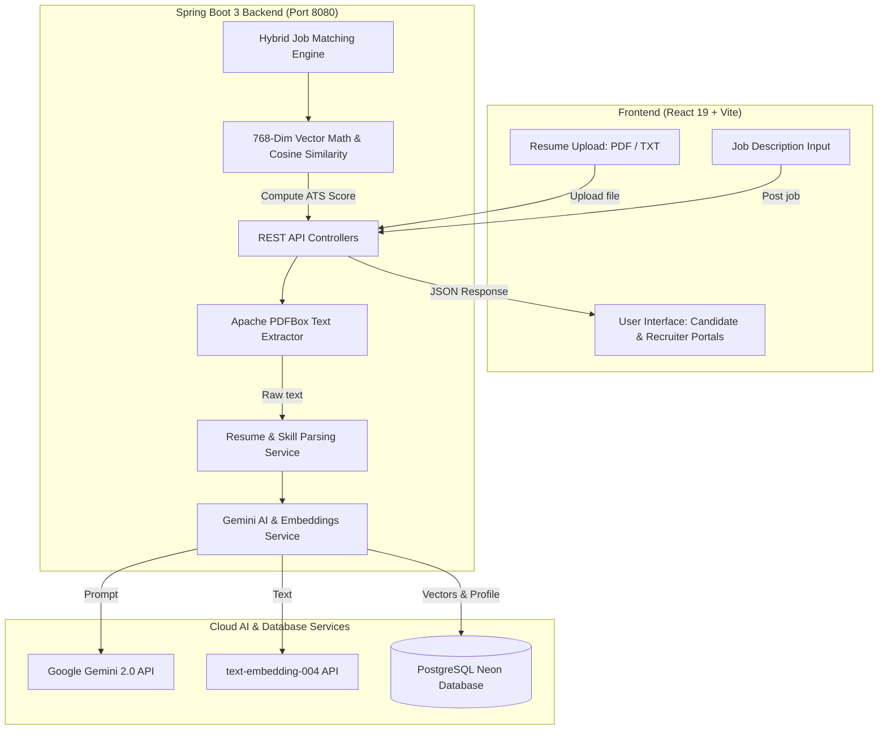
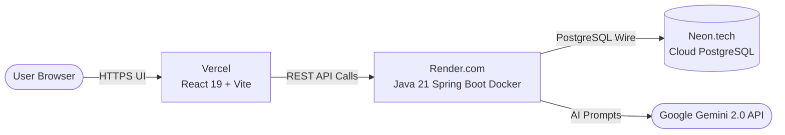

# Quick Hire — AI & NLP Hybrid Resume Screening & Job Matching Platform

[](https://www.oracle.com/java/)
[](https://spring.io/projects/spring-boot)
[](https://react.dev/)
[](https://vitejs.dev/)
[](https://tailwindcss.com/)
[](https://neon.tech/)
[](https://aistudio.google.com/)

> **Next-Generation Applicant Tracking System (ATS)** that combines **generative AI (Google Gemini 2.0 Flash)**, **768-dimensional NLP vector embeddings (`text-embedding-004`)**, and **cosine similarity mathematics** to evaluate resumes against job requirements with transparent skill gap analysis.

---

## 📑 Table of Contents
1. [Project Overview](#-project-overview)
2. [Tools & Technologies](#-tools--technologies)
3. [System Architecture & Workflow](#-system-architecture--workflow)
4. [Mathematical Formulation](#-mathematical-formulation)
5. [Step-by-Step Setup Guide (Clone & Run Locally)](#-step-by-step-setup-guide-clone--run-locally)
6. [☁️ Cloud Deployment Guide (Neon + Render + Vercel)](#️-cloud-deployment-guide-neon--render--vercel)
7. [Project Directory Structure](#-project-directory-structure)
8. [API Endpoints Reference](#-api-endpoints-reference)
9. [License & Acknowledgements](#-license--acknowledgements)

---

## 📌 Project Overview

Traditional Applicant Tracking Systems (ATS) rely primarily on exact keyword search. If a candidate lists *"React"* and *"Spring Boot"* but omits the exact string *"Full Stack Developer"*, rigid keyword filters discard them.

**Quick Hire** solves this by implementing a **hybrid AI & NLP matching pipeline**:
- **Semantic Understanding**: Uses Google Gemini to infer implied roles, skills, and experience levels.
- **Dense Vector Search**: Projects both resumes and job descriptions into a shared 768-dimensional vector space.
- **Mathematical Scoring**: Combines cosine similarity, explicit skill overlap, and role alignment.
- **Explainable Insights**: Identifies matched skills (green badges), missing skills (amber badges), and gives personalized resume improvement suggestions.

---

## 🛠️ Tools & Technologies

### 1. Backend
- **Java 21 (LTS)**: High-performance modern Java runtime.
- **Spring Boot 3.3.4**: Core RESTful micro-framework.
  - `spring-boot-starter-web`: Exposes REST endpoints with CORS support.
  - `spring-boot-starter-data-jpa`: Object-relational mapping via Hibernate.
  - `spring-boot-starter-validation`: DTO input validation.
- **Apache PDFBox 3.0.3**: Extract text streams from uploaded PDF resumes.
- **Maven Wrapper (`mvnw`)**: Zero-install build and dependency management.

### 2. Artificial Intelligence & NLP
- **Google Gemini 2.0 Flash (`gemini-2.0-flash`)**: High-speed generative inference for resume parsing, summary generation, and role deduction.
- **Google Embeddings (`text-embedding-004`)**: Generates 768-dimensional dense vector embeddings.
- **Local Fallback NLP Engine**: Deterministic hashing vectorizer and keyword matcher that ensures the platform runs smoothly even offline or without an active API key.

### 3. Database & Persistence
- **PostgreSQL (Neon Cloud)**: Production serverless PostgreSQL with SSL.
- **H2 In-Memory Database**: Automatic development/testing fallback.
- **Hibernate DDL Auto**: Dynamic database schema creation and update.

### 4. Frontend
- **React 19**: Reactive single-page component architecture.
- **Vite 8**: Ultra-fast module bundler and dev server.
- **Tailwind CSS v4**: Utility-first responsive styling and modern design tokens.
- **Lucide React**: Clean SVG icon system.

---

## 🏛️ System Architecture & Workflow

### Architectural Flowchart



---

### Step-by-Step Architecture Execution

#### **Step 1: Document Ingestion & Text Extraction**
- A candidate uploads a resume (`.pdf` or `.txt`) through the React portal.
- Spring Boot intercepts the multipart file upload in `ResumeController`.
- **Apache PDFBox 3.x** extracts plain text while filtering formatting noise, line breaks, and metadata.

#### **Step 2: AI Skill & Role Inference**
- The extracted text is sent to `GeminiAIService`.
- Google Gemini 2.0 analyzes the text and extracts:
  - Candidate contact info (name, email, phone)
  - Education and professional summary
  - Explicit technical skills
  - **Inferred Target Roles** (e.g., `React` + `Spring Boot` $\rightarrow$ `Full Stack Developer`, `Backend Developer`).
- *Note:* If Gemini API is unreachable or key is not provided, the local heuristic parser seamlessly extracts data without crashing.

#### **Step 3: 768-Dimensional Vector Embedding**
- The candidate's structured profile text is processed by Google's `text-embedding-004` model.
- A dense **768-dimensional float vector** is produced representing the semantic context of the candidate's capabilities.
- Recruiter job descriptions are similarly vectorized upon creation.

#### **Step 4: Persistence**
- The profile, extracted skills, target roles, and raw vector representations are stored in **PostgreSQL (Neon)** using Spring Data JPA entities (`CandidateProfile`, `Job`, `User`).

#### **Step 5: Hybrid Mathematical Matching Engine**
When evaluating a candidate against a job:
1. **Vector Cosine Similarity**: Compares candidate vector $\vec{R}$ with job vector $\vec{J}$.
2. **Skill Set Overlap**: Checks exact matching of required technical skills.
3. **Role Alignment Bonus**: Checks if inferred roles align with the job title.

#### **Step 6: Gap Analysis & Recommendations**
- The matching engine tags skills into two sets:
  - **Matched Skills** (Green): Skills present in both resume and job.
  - **Missing Skills** (Amber): Skills requested by the recruiter that the candidate lacks.
- Generates tailored suggestions to improve the candidate's ATS match rate.

#### **Step 7: Interactive UI Dashboard**
- Recruiter views candidate applicants sorted by overall ATS fit percentage.
- Candidate sees recommended jobs, match breakdown, and actionable suggestions.
- Live status tab checks Neon database connection and Gemini AI status in real time.

---

## 📐 Mathematical Formulation

### 1. NLP Vector Embedding Representation
$$\vec{R} \in \mathbb{R}^{768} \quad (\text{Candidate Resume Vector})$$
$$\vec{J} \in \mathbb{R}^{768} \quad (\text{Job Description Vector})$$

### 2. Cosine Similarity Formula
$$\text{Cosine Similarity}(\vec{R}, \vec{J}) = \frac{\vec{R} \cdot \vec{J}}{\|\vec{R}\| \|\vec{J}\|} = \frac{\sum_{i=1}^{768} R_i J_i}{\sqrt{\sum_{i=1}^{768} R_i^2} \sqrt{\sum_{i=1}^{768} J_i^2}}$$

### 3. Hybrid ATS Score
$$\text{Overall Fit Score} = (0.45 \times \text{Cosine Sim}) + (0.45 \times \text{Skill Overlap}) + (0.10 \times \text{Role Alignment Bonus})$$

---

## 🚀 Step-by-Step Setup Guide (Clone & Run)

Follow these exact steps to set up and run Quick Hire on any computer.

### Prerequisites

Ensure you have installed:
1. **Git**: [Download Git](https://git-scm.com/downloads)
2. **Java 21 JDK (LTS)**: [Download Eclipse Temurin 21](https://adoptium.net/temurin/releases/?version=21) or [Oracle JDK 21](https://www.oracle.com/java/technologies/downloads/#java21)
3. **Node.js (v18 or higher)**: [Download Node.js](https://nodejs.org/)

Verify your installations in terminal:
```bash
git --version
java -version
node -v
npm -v
```

---

### Step 1: Clone the Repository

```bash
git clone https://github.com/<your-username>/quick-hire.git
cd quick-hire
```

---

### Step 2: Configure Environment Variables

1. Navigate to the `backend/` folder:
   ```bash
   cd backend
   ```
2. Copy the template file `.env.example` to create `.env`:
   - **Windows (PowerShell / CMD)**:
     ```powershell
     copy .env.example .env
     ```
   - **macOS / Linux**:
     ```bash
     cp .env.example .env
     ```
3. Open `backend/.env` in any text editor and fill in your values:
   ```properties
   # Free key from https://aistudio.google.com/app/apikey
   GEMINI_API_KEY=your_gemini_api_key_here

   # Database credentials (PostgreSQL Neon, Supabase, or local PostgreSQL)
   DB_URL=jdbc:postgresql://your-neon-host.neon.tech/neondb?sslmode=require
   DB_USER=your_db_username
   DB_PASS=your_db_password
   ```
   > 💡 **Tip:** If you do not have a PostgreSQL database yet, you can leave the database fields empty or point to an H2 local database. The application includes automatic fallback for zero-setup local testing!

---

### Step 3: Run the Spring Boot Backend

From the `backend/` directory:

- **Windows**:
  ```powershell
  # Using the included one-click script:
  .\run-backend.bat

  # OR using Maven wrapper:
  .\mvnw.cmd spring-boot:run
  ```

- **macOS / Linux**:
  ```bash
  chmod +x mvnw
  ./mvnw spring-boot:run
  ```

The backend server will start on **`http://localhost:8080`**.
You can verify it by opening `http://localhost:8080/api/config/status` in your browser.

---

### Step 4: Run the React Frontend

Open a **new terminal window** and navigate to the `frontend/` folder:

```bash
cd quick-hire/frontend
```

1. **Install dependencies**:
   ```bash
   npm install
   ```

2. **Start the development server**:
   - **Windows**:
     ```powershell
     # Using the included one-click script:
     .\run-frontend.bat

     # OR using npm:
     npm run dev
     ```
   - **macOS / Linux**:
     ```bash
     npm run dev
     ```

3. Open **`http://localhost:5173`** in your browser.

---

### Step 5: Test the Application

1. Open `http://localhost:5173`.
2. Go to **Candidate Portal** $\rightarrow$ Click **"Upload Resume"**.
3. Choose the included [`sample_resume.txt`](file:///x:/all%20in%20one/All_Projects/quick-hire/sample_resume.txt) or upload your own PDF resume.
4. Watch the AI parse your profile, generate target roles, and compute matches against pre-seeded jobs!
5. Switch to **Recruiter Portal** to view candidates ranked by ATS fit score or post new jobs.

---

---

## ☁️ Cloud Deployment Guide (Neon + Render + Vercel)

Deploy the entire Quick Hire stack 100% free with automated continuous deployment on Git push.



---

### Step 1: Create Free PostgreSQL Database on Neon.tech
1. Sign up at [Neon.tech](https://neon.tech/) (free, no credit card required).
2. Click **Create Project** $\rightarrow$ Name it `quick-hire-db`.
3. In your Neon dashboard, locate the **Connection Details** widget:
   - Select **Connection string** $\rightarrow$ **Java (JDBC)**.
   - Note down:
     - **JDBC URL**: e.g., `jdbc:postgresql://ep-xyz.us-east-2.aws.neon.tech/neondb?sslmode=require`
     - **User**: e.g., `neondb_owner`
     - **Password**: `your_neon_password`

---

### Step 2: Deploy Spring Boot Backend on Render.com
1. Sign in to [Render.com](https://render.com/) with your GitHub account.
2. Click **New +** $\rightarrow$ **Web Service**.
3. Connect your GitHub repository (`quick-hire`).
4. Configure the service settings:
   - **Name**: `quick-hire-backend`
   - **Language**: **`Docker`** *(Render automatically detects `backend/Dockerfile`)*
   - **Branch**: `main`
   - **Region**: Choose the region closest to your Neon database (e.g., `Oregon (US West)` or `Frankfurt (EU)`)
   - **Root Directory**: **`backend`**
   - **Instance Type**: **Free** ($0/month, 512 MB RAM)
5. Scroll down to **Environment Variables** and add the following keys:
   | Key | Value | Notes |
   | :--- | :--- | :--- |
   | `DB_URL` | `jdbc:postgresql://ep-xyz.neon.tech/neondb?sslmode=require` | From Neon dashboard |
   | `DB_USER` | `your_neon_username` | From Neon dashboard |
   | `DB_PASS` | `your_neon_password` | From Neon dashboard |
   | `GEMINI_API_KEY` | `AIzaSy...` | From [Google AI Studio](https://aistudio.google.com/app/apikey) |
   | `PORT` | `8080` | Container port |
6. Click **Deploy Web Service**.
7. Render will build the Docker container and start your Spring Boot application.
8. Once live, Render displays your public backend URL, for example:  
   `https://quick-hire-backend.onrender.com`
9. Test health in your browser:  
   `https://quick-hire-backend.onrender.com/api/config/status`

---

### Step 3: Deploy React Frontend on Vercel
1. Sign up/log in at [Vercel](https://vercel.com/) with your GitHub account.
2. Click **Add New...** $\rightarrow$ **Project**.
3. Import your `quick-hire` repository.
4. Configure the project build settings:
   - **Framework Preset**: `Vite`
   - **Root Directory**: Click *Edit* and select **`frontend`**
   - **Build Command**: `npm run build` *(default)*
   - **Output Directory**: `dist` *(default)*
5. Expand **Environment Variables** and add:
   - **Name**: `VITE_API_BASE_URL`
   - **Value**: `https://quick-hire-backend.onrender.com/api` *(replace with your actual Render URL + `/api`)*
6. Click **Deploy**.
7. Vercel will build and assign you a global production URL:  
   `https://quick-hire.vercel.app`

---

### Step 4: Verification & Live Testing
1. Visit your live Vercel URL in your browser.
2. Navigate to **System Status & Settings** tab:
   - Ensure the database connection status displays **Active / Connected**.
   - Check that Gemini AI status is **Ready**.
3. Upload a sample resume in the **Candidate Portal** and verify that role inference, vector scoring, and recruiter rankings work seamlessly in production.

---

## 📁 Project Directory Structure

```text
quick-hire/
├── .gitignore                          # Global gitignore (ignores .env, target, node_modules)
├── README.md                           # Master project documentation
├── sample_resume.txt                   # Sample test resume file
│
├── backend/                            # Spring Boot 3 Java Application
│   ├── Dockerfile                      # Multi-stage Java 21 build for Render deployment
│   ├── .dockerignore                   # Excludes build artifacts & secrets from Docker image
│   ├── .env.example                    # Environment variable template
│   ├── mvnw / mvnw.cmd                 # Maven wrapper executables
│   ├── pom.xml                         # Maven dependencies & build configuration
│   ├── run-backend.bat                 # One-click Windows startup script
│   └── src/
│       ├── main/
│       │   ├── java/com/quickhire/
│       │   │   ├── QuickHireApplication.java       # Spring Boot main entrypoint
│       │   │   ├── config/                         # CORS & DB seed configuration
│       │   │   ├── controller/                     # REST API controllers
│       │   │   ├── model/                          # JPA entities & DTO models
│       │   │   ├── repository/                     # Spring Data JPA repositories
│       │   │   ├── service/                        # Business logic (Gemini AI, Matching, Parsing)
│       │   │   └── util/                           # Vector mathematics & Cosine Similarity
│       │   └── resources/
│       │       └── application.properties          # Spring configuration & dynamic port bindings
│       └── test/                                   # Unit & integration tests
│
└── frontend/                           # React 19 + Vite + Tailwind CSS Application
    ├── index.html                      # HTML entrypoint
    ├── package.json                    # Frontend dependencies & scripts
    ├── vite.config.js                  # Vite configuration
    ├── vercel.json                     # SPA routing rewrite rule for Vercel
    ├── .env.example                    # Frontend environment variable template
    ├── run-frontend.bat                # One-click Windows startup script
    └── src/
        ├── App.jsx                     # Main application layout & portal tabs
        ├── api.js                      # Dynamic REST API client (supports VITE_API_BASE_URL)
        ├── main.jsx                    # React root renderer
        ├── index.css                   # Global styles & Tailwind CSS imports
        └── assets/                     # Application logos and SVG icons
```

---

## 🔌 API Endpoints Reference

| Method | Endpoint | Description |
| :--- | :--- | :--- |
| `GET` | `/api/config/status` | System health check (Gemini AI & database status) |
| `POST` | `/api/resume/upload` | Upload resume (PDF or TXT) & extract candidate profile |
| `GET` | `/api/resume/profiles` | List all saved candidate profiles |
| `GET` | `/api/jobs` | Retrieve all active job postings |
| `POST` | `/api/jobs` | Create a new job description with required skills |
| `GET` | `/api/match/candidate/{candidateId}` | Retrieve top matching jobs for a candidate |
| `GET` | `/api/match/job/{jobId}` | Retrieve ranked candidate matches for a recruiter job |
| `POST` | `/api/match/calculate` | Compute real-time ATS match between candidate & job |

---

## 📄 License & Acknowledgements

- **Google Gemini API**: Generative AI and embedding models provided by [Google AI Studio](https://aistudio.google.com/).
- **Apache PDFBox**: Open-source Java PDF library developed by the [Apache Software Foundation](https://pdfbox.apache.org/).
- Built as a **Capstone Project** demonstrating practical, production-ready AI & NLP integration in modern web applications.
